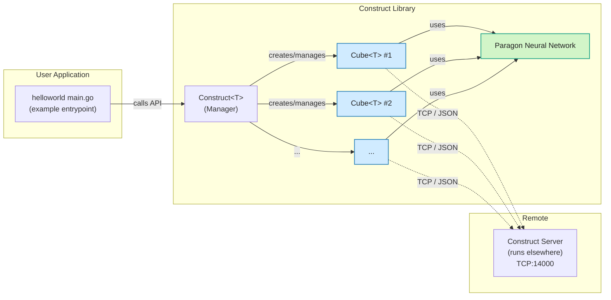

# Construct

Construct is a Go package for managing and simulating cubes in a networked environment, such as a game or physics simulation. It allows you to spawn cubes, apply forces to them using neural network models, and manage their state through a TCP connection to a server. The cubes' movements are driven by neural network outputs, making it suitable for experiments in AI-driven simulations.

## Mermaid source code



## Features

- **Spawn and Despawn Cubes**: Create and remove cubes with specific names and positions.
- **Neural Network Control**: Apply forces to cubes based on outputs from neural network models.
- **Position Updates**: Refresh cube positions from the server in real-time.
- **Batch Operations**: Manage multiple cubes with methods like `SpawnAll`, `DestroyAllCubes`, and `UnfreezeAll`.
- **Pulsing Mechanism**: Continuously apply forces to cubes at a specified rate.

## Prerequisites

- A running server that accepts TCP connections and processes JSON commands like `spawn_cube`, `despawn_cube`, `apply_force`, and `get_cube_state`.
- Go programming environment with the `construct` package and its dependency installed.

## Installation

Clone the repository and install dependencies:

```bash
git clone https://github.com/OpenFluke/construct.git
cd construct
go mod tidy
```

## Dependencies

- [PARAGON](https://github.com/OpenFluke/PARAGON): A neural network library for creating and managing the models that control the cubes.

## Usage

To use Construct, connect to a server and define cubes with neural network models. The package communicates with the server via TCP, sending commands and receiving state updates.

### Example

This example demonstrates how to spawn cubes, apply forces, and monitor their distances to a goal position. It’s based on the `helloworld` example in the repository:

```go
package main

import (
	"fmt"
	"math"
	"sync"
	"time"

	"construct"
	paragon "github.com/OpenFluke/PARAGON"
)

func main() {
	addr := "localhost:14000"
	pass := "my_secure_password"
	delimiter := "<???DONE???---"

	// Create Construct instance
	c := &construct.Construct[float64]{
		ServerAddr: addr,
		AuthPass:   pass,
		Delimiter:  delimiter,
		ClampMin:   -20.0,
		ClampMax:   20.0,
	}

	goal := []float64{100, 0, 0} // Target position

	// Create cubes with simple random models
	for i := 0; i < 5; i++ {
		model := paragon.NewNetwork[float64](
			[]struct{ Width, Height int }{{3, 1}, {4, 1}, {3, 1}},
			[]string{"leakyrelu", "relu", "linear"},
			[]bool{true, true, true},
		)

		cube := &construct.Cube[float64]{
			Name:       fmt.Sprintf("cube_hello_%d", i),
			Position:   []float64{float64(i * 5), 120, 10},
			UnitName:   "HelloUnit",
			Model:      model,
			ServerAddr: addr,
			AuthPass:   pass,
			Delimiter:  delimiter,
			ClampMin:   -20.0,
			ClampMax:   20.0,
		}
		c.Cubes = append(c.Cubes, cube)
	}

	// Spawn & unfreeze
	fmt.Println("🚀 Spawning cubes...")
	c.SpawnAll()
	time.Sleep(1 * time.Second)

	fmt.Println("🧊 Unfreezing cubes...")
	c.UnfreezeAll()

	// Show active cube names
	fmt.Println("📦 Fetching cube names from server...")
	if names, err := c.GetAllCubeNames(); err != nil {
		fmt.Println("❌ Failed to fetch cube names:", err)
	} else {
		fmt.Println("✅ Cube names on server:")
		for _, name := range names {
			fmt.Println(" -", name)
		}
	}

	// Track distances during pulsing
	fmt.Println("⚡ Starting pulse + monitor loop...")

	scores := make(map[string]float64)
	var mu sync.Mutex

	// Start monitoring in parallel
	var wg sync.WaitGroup
	wg.Add(1)
	go func() {
		defer wg.Done()
		ticker := time.NewTicker(500 * time.Millisecond)
		defer ticker.Stop()
		timeout := time.After(5 * time.Second)

		for {
			select {
			case <-ticker.C:
				mu.Lock()
				for _, cube := range c.Cubes {
					dist := distance(cube.Position, goal)
					scores[cube.Name] = dist
				}
				mu.Unlock()
			case <-timeout:
				return
			}
		}
	}()

	// Run pulsing in main thread (waits for 5 seconds total)
	c.StartPulsing(100, 5*time.Second)

	// Wait for monitor thread to finish
	wg.Wait()

	// Show results
	fmt.Println("🏁 Final distances to goal:")
	var bestName string
	bestScore := math.MaxFloat64
	for name, score := range scores {
		fmt.Printf(" - %s: %.2f\n", name, score)
		if score < bestScore {
			bestScore = score
			bestName = name
		}
	}
	fmt.Printf("🥇 Best performing cube: %s (distance %.2f)\n", bestName, bestScore)

	// Cleanup
	fmt.Println("💣 Despawning cubes...")
	c.DestroyAllCubes()
}

func distance(a, b []float64) float64 {
	if len(a) != len(b) {
		return math.MaxFloat64
	}
	sum := 0.0
	for i := range a {
		diff := a[i] - b[i]
		sum += diff * diff
	}
	return math.Sqrt(sum)
}
```

### Explanation

1. **Initialization**: Set up a `Construct` instance with server details and clamping values.
2. **Cube Creation**: Define cubes with initial positions and neural network models from PARAGON.
3. **Spawning**: Use `SpawnAll` to create cubes on the server, appending "\_BASE" to their names.
4. **Unfreezing**: Allow cubes to move with `UnfreezeAll`.
5. **Pulsing**: Apply forces to cubes using `StartPulsing`, driven by neural network outputs.
6. **Monitoring**: Track cube distances to a goal position in a separate goroutine.
7. **Cleanup**: Remove all cubes with `DestroyAllCubes`.

## Notes

- **Server Requirements**: The server must handle JSON commands and maintain cube states.
- **Clamping**: Adjust `ClampMin` and `ClampMax` to limit the forces applied to cubes.
- **UnitName**: Currently unused in the code but may be relevant for server-side features.

## Repository

For more examples and details, visit the [GitHub repository](https://github.com/OpenFluke/construct). Check the `example/helloworld` directory for additional usage scenarios.
